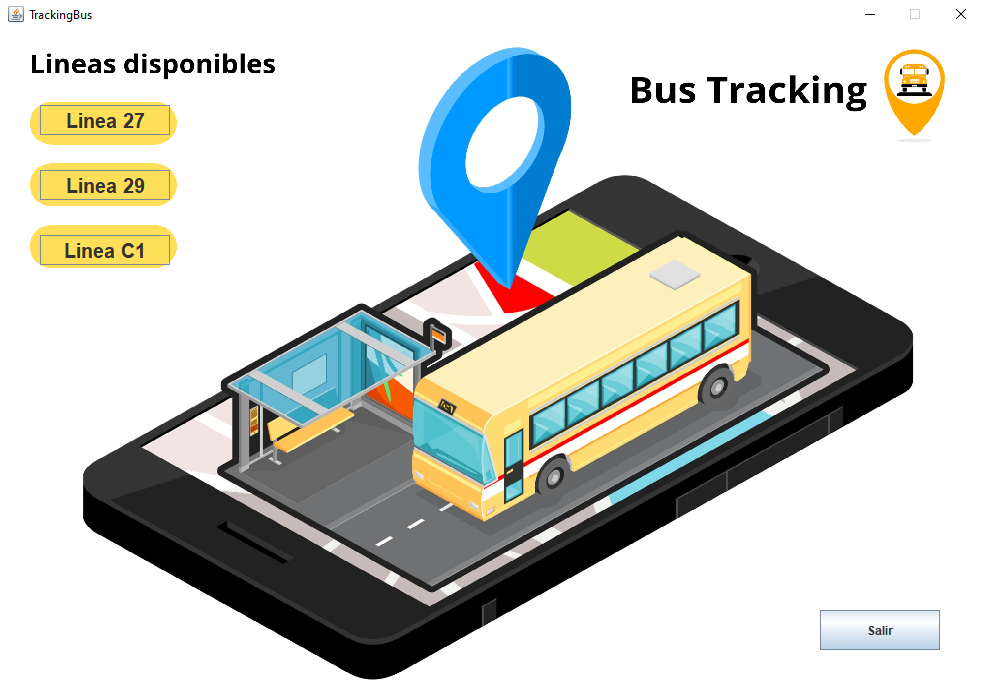

# 🚌 Bus Traking

**Bus Traking** es una aplicación diseñada para realizar un seguimiento en tiempo real de los autobuses, permitiendo a los usuarios visualizar rutas, paradas y la ubicación actual.
---

## 📸 Vistas Previas

A continuación, se muestran algunos bocetos de como podria llegar a verse la interfaz del programa:

### Vista 1 – Inicio con elección de las diferentes lineas de autobuses disponibles

### Vista 2 – Ruta disponible y paradas con mapa con ubicación en tiempo real

### Vista 3 – Registro de actividad reciente de la linea. Incluye fecha, hora, posicion hps y velocidad media.

---

## 🚀 Funcionalidades principales

- Visualización en tiempo real de autobuses en el mapa.
- Consulta de rutas, horarios y paradas.
- Interfaz intuitiva.

---
